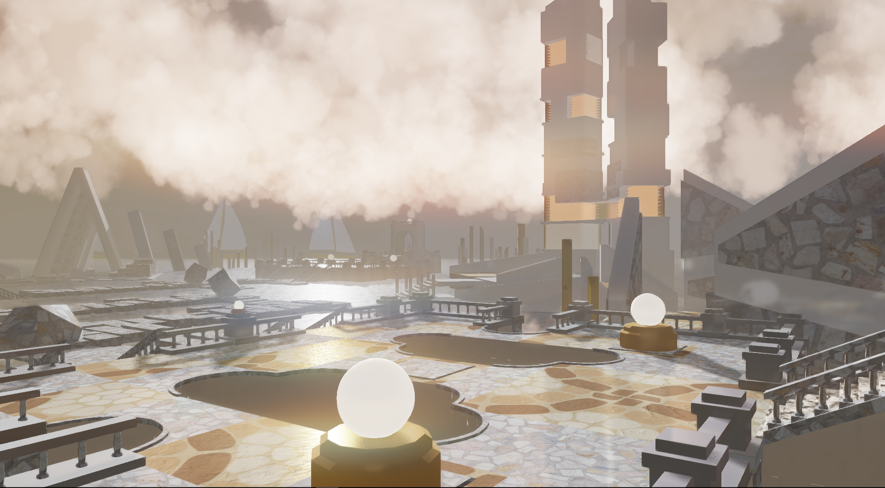
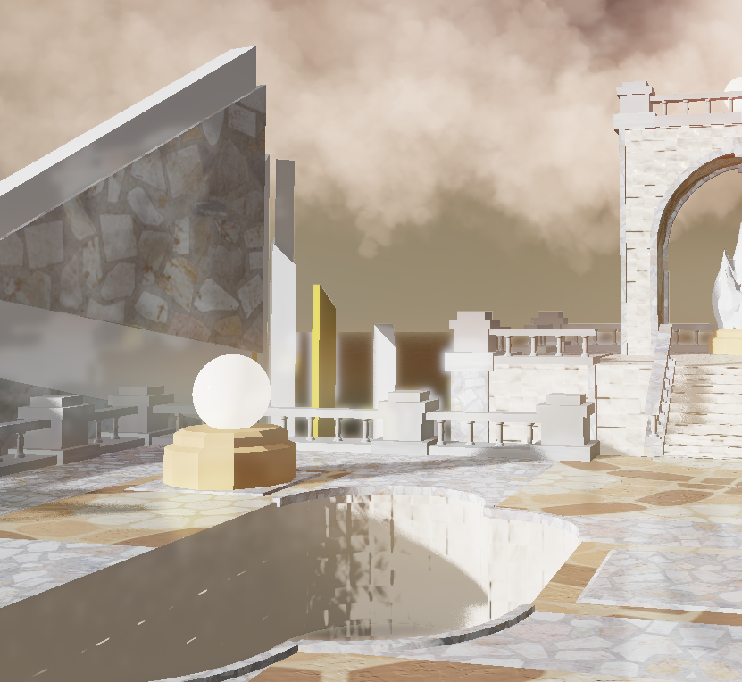
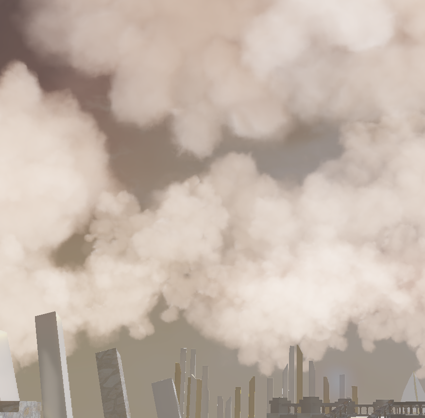
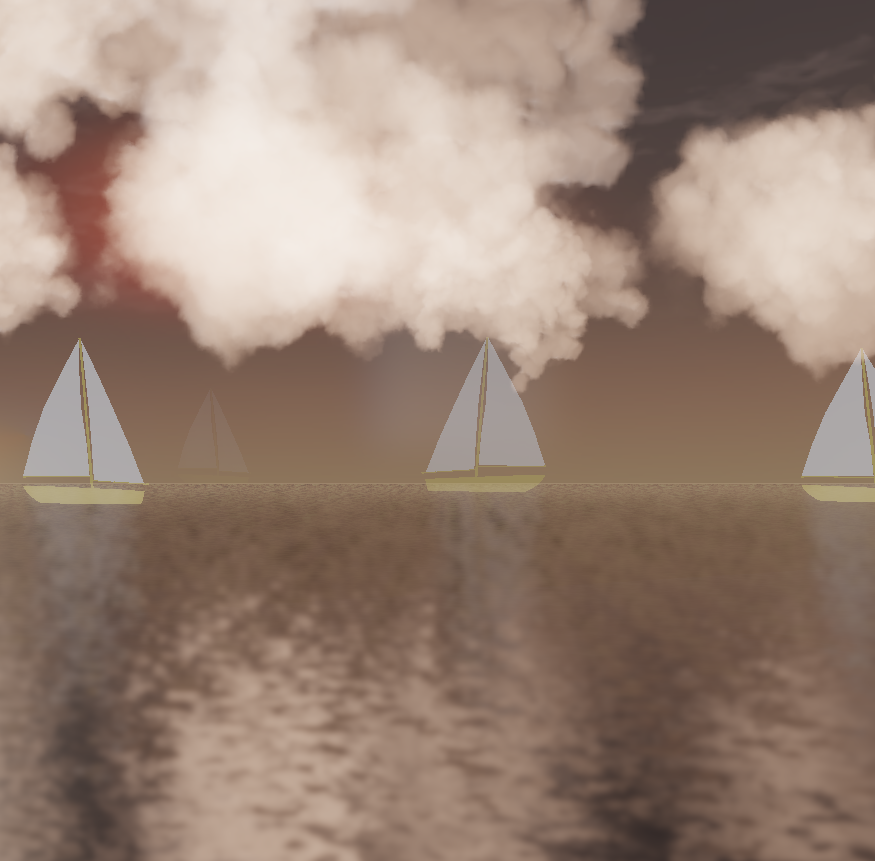
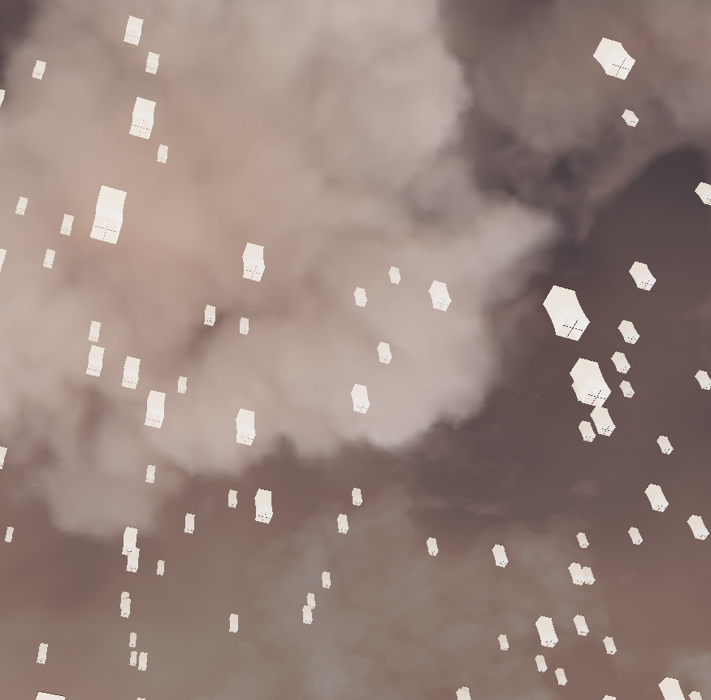
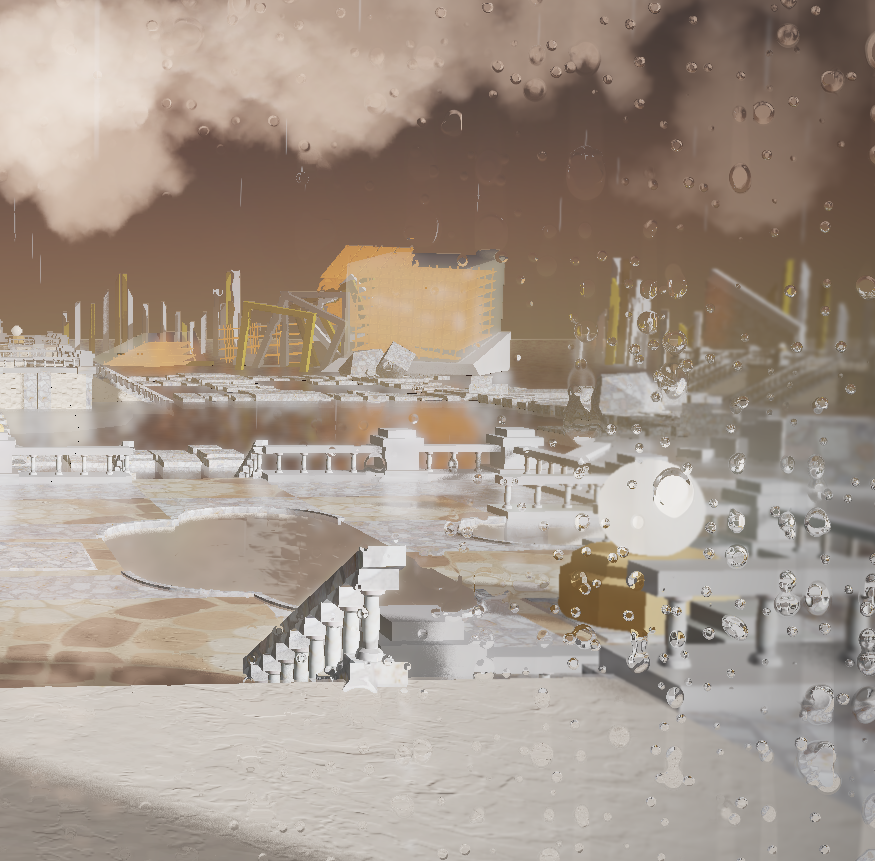

# The Shrines
* CGGT, University of Pennsylvania
* Byumjin Kim, Jiawei Wang
* Apr. 2018

## Live Demo

| The Shrines |
|---|
||

* [Demo Link](https://byumjin.github.io/The-Shrines/)

## Overview

We have implemented WebGL demo with using many procedural methods for the final project of Procedural programming. After watching the WebGL demo [After the Flood](https://playcanv.as/e/p/44MRmJRU/) (made by PlayCanvas), we want to challenge to make fancy demo scene like that. Most of textures and models in our demo are designed by us. And, we tried to maintain 60 fps on Nvidia GTX 1060 in FHD resolution (1920 x 1080).

## Pipeline

| Pipeline |
|---|
||

## Features

### Deferred Rendering

We chose deferred rendering for getting screen space information such as rougness, normal, easily, and used 3 G-buffers (first one is for albedo color and opacity, second one is for specular color and roughness, last one is for normal and emissive). And, we used GGX lighting model for physically-based rendering. For perfection, it needs some methods such as pre-filtered light probe to get global illumination in real-time, we only used screen space reflections.

### Shadow

We used shadow mapping to create dynamic shadows. We chose 2048x2048 texture buffer to store the depth map. To create soft shadow, we tried many methods to realize that, like VSM, PCSS, PCF, etc. Finally, we decided to use **Stratified Poisson-Sampling PCF**. We created soft shadows of static objects(like buildings) and dynamic objects(like trees), and the shadows casted on both opaque objects and tranparent objects(water).

|No Shadow|With Shadow|
|---|---|
|||

|Hard Shadow|Soft Shadow|
|---|---|
|||

### Moving Trees

To render the trees with animation, we need to modify the vertex positions according to time in vertex shader(vertex animation). So we could no longer to use the same vertex shader as other static objects. Here we used 2 other different shaders for the barks and leaves in *RenderToGBuffer* pass.
To create the animation of the trees, we followed the instructions of [Vegetation Procedural Animation and Shading in Crysis](https://developer.nvidia.com/gpugems/GPUGems3/gpugems3_ch16.html). We used three channels of the vertex color to represent three different kinds of movement of the leaves, the red channel is used for the stiffness of leaves' edges, the green channel for per-leaf phase variation, and the blue channel for the overall stiffness of the leaves.
The only problem was that the .obj file cannot store the vertex color information, and we were using TypeScript for the development, so we cannot use fbxLoader tools of three.js. Finally, we stored the vertex colors in another format of file, .ply. When loading models of tree, we both loaded .obj files for positions, normals, texcoords and .ply files for colors.

|Tree Rendering|Vertex Color|
|---|---|
|||

### Translucent Material

To add translucent material, we needed to use additional depth buffer only for it and compare with G-buffer's depth buffer. The reason why we could not use G-buffer's depth buffer is for blending between the result of translucent rendering and opaque rendering. And, to present real translucent, the ordering problem should be addressed. But, we just used one layer translucent for simplicity.

#### Water

For making wavy water, we used noise map which has 3 noise channels like perlin and worley and blend them with different time seed instead of using normal map. And, our water material compares the depth between opaque and water for changable blending effects along the distance between them.

### Screen Space Reflections

| SSR Off | SSR On | SSR Off | SSR On |
|---|---|---|---|
|||||

To obtain dynamic global illumination, we referred to [Reflection and volumetrics of Killzone Shadow Fall](http://advances.realtimerendering.com/s2014/valient/Valient_Siggraph14_Killzone.pptx) for our screen space reflections. It uses simple linear interpolation to complement the artifacts caused by overshooting ray. And, as using previous frame instead of current frame, we could get secondary reflections and even reflections of particle. And we realized that even if we are super large step size of water material, it is difficult to recognize its artifacts. So, our demo can reflect the original scene image even when the camera sees the scene from far away.

### GPU particles

We used feedback transformation to generate thousands particles with lower cost. Unexpectedly, feedback transformation is slower than the method using texture to create a bunch of particles (over 1 million). This is caused by the fact that the cost will increase significantly as feedback transformation's buffer size increases. This is because the array retrieving time increases as the index of the array element increases. But, it is true that, in terms of management, feedback transformation is more comfortable than texture particles because it does not need fragment shader stage.
We made our particles with billboard quad or object's mesh itself. To reduce disharmony, we blended our particles from original scene image with scene depth.

| Clouds | Boats | Lanterns | Rain | Snow | Flowers |
|---|---|---|---|---|---|
|||||||

#### Clouds

| Clouds |
|---|
||

We also used similar noise map like those of water to make the clouds spread. And, to make them like volumetric clouds, normal map is used for lighting. Unlike usual lambertian shading, we used smoothstep of absolute value of N dot L with 0.2 as minimal value. This prevents to make clouds to be balck and brighter when the clouds' billborad faces sun light. 

### Procedural Roads

We used L-System to generate the diffrent roads, and there are multiple base geometries for the roads and the connection corners, which are randomly generated during every reloading of the scene.

|Random 1|Random 2|Random 3|
|---|---|---|
||||

### HDR

#### Bloom

| Bloom |
|---|
||

For this, we have used down-sampled( divide by 8 ) scene texture which has high light of scene image before post-process phases for performance optimization and to get a better quality result. To blur image, Gaussian blurring method is used at two passes with mipmaps (The first pass is for Horizontal Blurring, and the second pass is for Vertical Blurring). And, like alien isolation's bloom effect, we set longer steps to strectch blurring effect, horizontally.

#### Lens Flare

| Lens Flare |
|---|
||

Using same high light scene image as Bloom, we could create ghost effects with distortion and repeatation by center of screen. For better quality, Gaussian blurring is also used. We referred to [John chapman’s Lens flare](http://john-chapman-graphics.blogspot.com/2013/02/pseudo-lens-flare.html) which is not physically correct.

### Tone Map

We used flimic tone mapping referred to [here](https://www.shadertoy.com/view/lslGzl)

### Post-Process in Single Screen Triangular

|Frost|Rainy|Fire|
|---|---|---|
||||

We implemented 3 post-process effects for Ice Shrine, Water Shrine and Fire Shrine.
* Frost Effect: set the uv offsets based on the computation with a noise image. [frosted glass vignette](https://www.shadertoy.com/view/MsySzy) 
* RainDrops Effect: manipulate with the uv offsets to create the water drops effect, mainly following the reference [Heartfelt](https://www.shadertoy.com/view/ltffzl). Also use the Gaussian Blur to create the blurry parts and the tracks of the water.
* Fire Effect: blend the fire effect with the render result of the scene and then add a haze effect. 

## Reference

- [Reflection and volumetrics of Killzone Shadow Fall](http://advances.realtimerendering.com/s2014/valient/Valient_Siggraph14_Killzone.pptx)
- [John chapman’s Lens flare](http://john-chapman-graphics.blogspot.com/2013/02/pseudo-lens-flare.html)
- [Tone map](https://www.shadertoy.com/view/lslGzl)
- [Advanced Soft Shadow Mapping](http://developer.download.nvidia.com/presentations/2008/GDC/GDC08_SoftShadowMapping.pdf)

## Music

- idealism - another perspective

