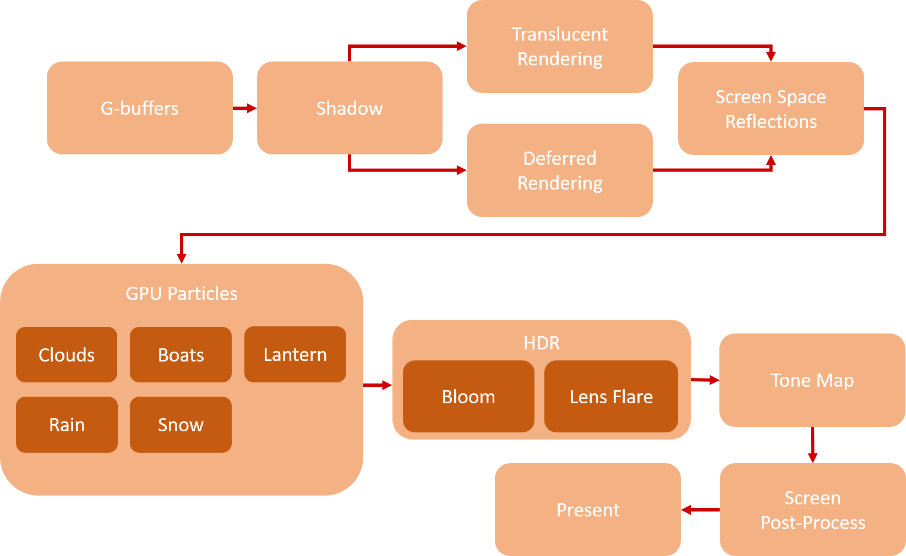
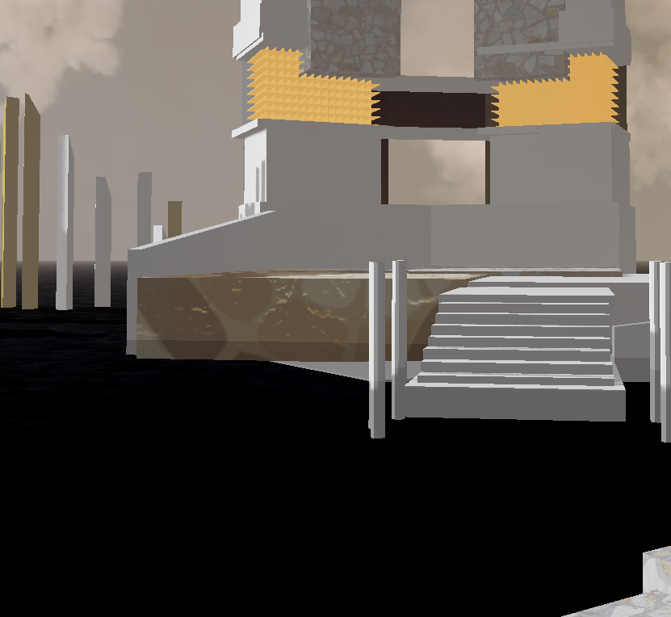
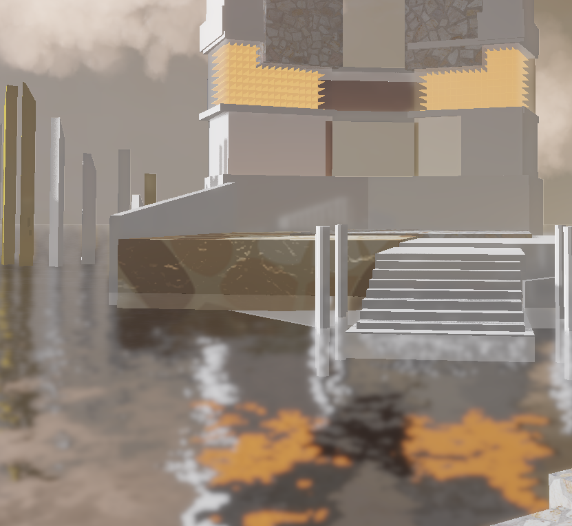
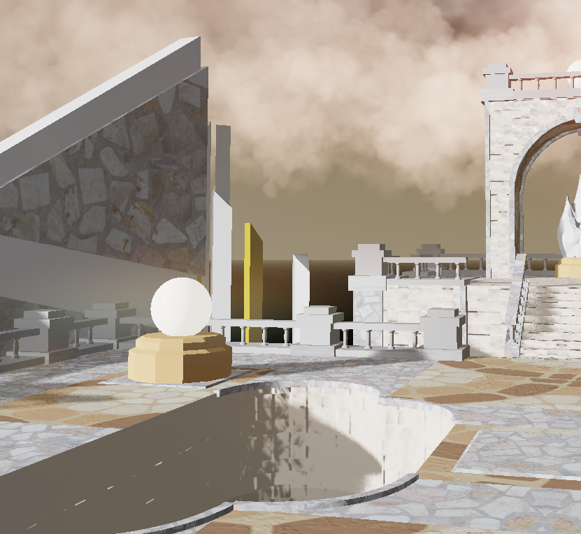
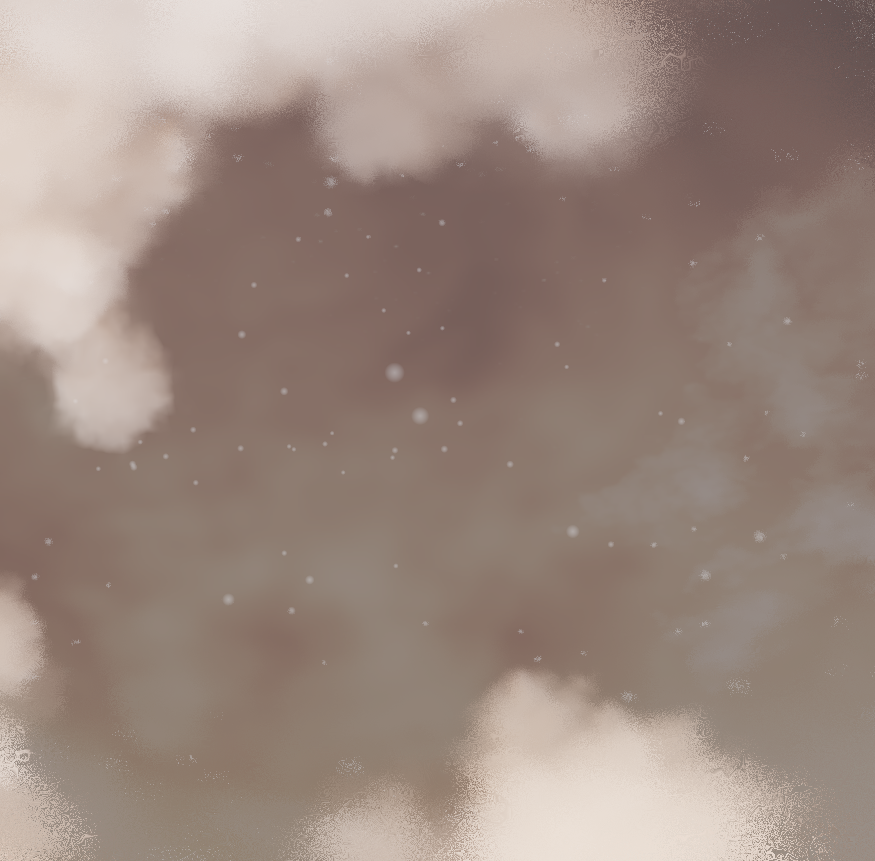
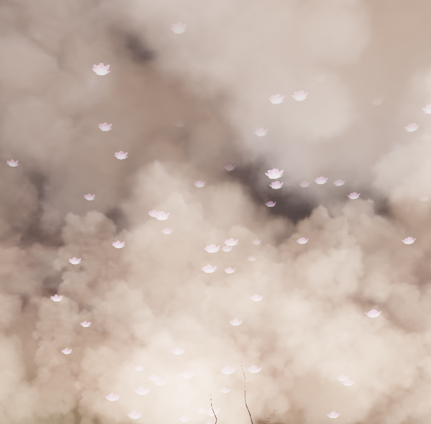
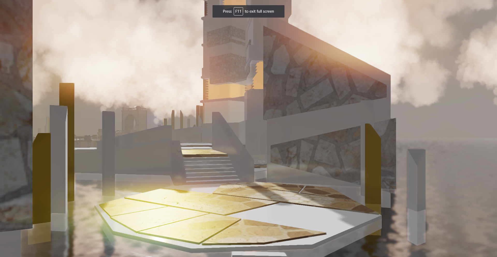

# The Shrines
* CGGT, University of Pennsylvania
* Byumjin Kim, Jiawei Wang
* Apr. 2018

## Live Demo

| The Shrines |
|---|
||

* [Demo Link](https://byumjin.github.io/The-Shrines/)

## Overview

We have implemented WebGL demo with using many procedural methods for the final project of Procedural programming. After watching the WebGL demo [After the Flood](https://playcanv.as/e/p/44MRmJRU/) (made by PlayCanvas), we want to challenge to make fancy demo scene like that. Most of textures and models in our demo are designed by us. And, we tried to maintain 60 fps on Nvidia GTX 1060 in FHD resolution (1920 x 1080).

## Pipeline

| Pipeline |
|---|
||

## Features

### Deferred Rendering

We chose deferred rendering for getting screen space information such as rougness, normal, easily, and used 3 G-buffers (first one is for albedo color and opacity, second one is for specular color and roughness, last one is for normal and emissive). And, we used GGX lighting model for physically-based rendering. For perfection, it needs some methods such as pre-filtered light probe to get global illumination in real-time, we only used screen space reflections.

### Shadow
...

### Translucent Material

To add translucent material, we needed to use additional depth buffer only for it and compare with G-buffer's depth buffer. The reason why we could not use G-buffer's depth buffer is for blending between the result of translucent rendering and opaque rendering. And, to present real translucent, the ordering problem should be addressed. But, we just used one layer translucent for simplicity.

#### Water

For making wavy water, we used noise map which has 3 noise channels like perlin and worley and blend them with different time seed instead of using normal map. And, our water material compares the depth between opaque and water for changable blending effects along the distance between them.

### Screen Space Reflections

| SSR Off | SSR On | SSR Off | SSR On |
|---|---|---|---|
|||||

To obtain dynamic global illumination, we referred to [Reflection and volumetrics of Killzone Shadow Fall](http://advances.realtimerendering.com/s2014/valient/Valient_Siggraph14_Killzone.pptx) for our screen space reflections. It uses simple linear interpolation to complement the artifacts caused by overshooting ray. And, as using previous frame instead of current frame, we could get secondary reflections and even reflections of particle. And we realized that even if we are super large step size of water material, it is difficult to recognize its artifacts. So, our demo can reflect the original scene image even when the camera sees the scene from far away.

### GPU particles

We used feedback transformation to generate thousands particles with lower cost. Unexpectedly, feedback transformation is slower than the method using texture to create a bunch of particles (over 1 million). This is caused by the fact that the cost will increase significantly as feedback transformation's buffer size increases. This is because the array retrieving time increases as the index of the array element increases. But, it is true that, in terms of management, feedback transformation is more comfortable than texture particles because it does not need fragment shader stage.
We made our particles with billboard quad or object's mesh itself. To reduce disharmony, we blended our particles from original scene image with scene depth.

| Clouds | Boats | Lanterns | Rain | Snow | Flowers |
|---|---|---|---|---|---|
|||||||

#### Clouds

| Clouds |
|---|
||

We also used similar noise map like those of water to make the clouds spread. And, to make them like volumetric clouds, normal map is used for lighting. Unlike usual lambertian shading, we used smoothstep of absolute value of N dot L with 0.2 as minimal value. This prevents to make clouds to be balck and brighter when the clouds' billborad faces sun light. 

### HDR

#### Bloom

| Bloom |
|---|
||

For this, we have used down-sampled( divide by 8 ) scene texture which has high light of scene image before post-process phases for performance optimization and to get a better quality result. To blur image, Gaussian blurring method is used at two passes with mipmaps (The first pass is for Horizontal Blurring, and the second pass is for Vertical Blurring). And, like alien isolation's bloom effect, we set longer steps to strectch blurring effect, horizontally.

#### Lens Flare

| Lens Flare |
|---|
||

Using same high light scene image, we can create ghost effects with distortion and repeatation by center of screen. For better quality, Gaussian blurring is also used. We referred to [John chapman’s Lens flare](http://john-chapman-graphics.blogspot.com/2013/02/pseudo-lens-flare.html) which is not physically correct.

### Tone Map

We used flimic tone mapping referred to [here](https://www.shadertoy.com/view/lslGzl)

### Post-Process in Single Screen Triangular

.....

## Reference

- [Reflection and volumetrics of Killzone Shadow Fall](http://advances.realtimerendering.com/s2014/valient/Valient_Siggraph14_Killzone.pptx)
- [John chapman’s Lens flare](http://john-chapman-graphics.blogspot.com/2013/02/pseudo-lens-flare.html)
- [Tone map](https://www.shadertoy.com/view/lslGzl)

## Music

- idealism - another perspective

